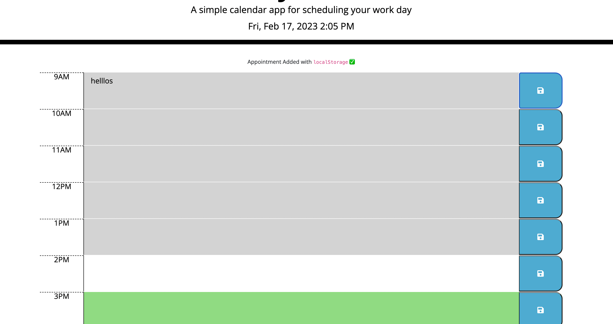

# Work-Day-Scheduler

## Description

This is a calendar application that allows a user to save events for each hour of the day.
It tracks the current time and color codes the calender depending on the weather.
There is a button next to each input which allows the user to append notes

deployed website URL: 

gitHub repo URL: https://github.com/Tomal1/Work-Day-Scheduler

## Usage

## License
Please refer to the LICENSE in the repo.